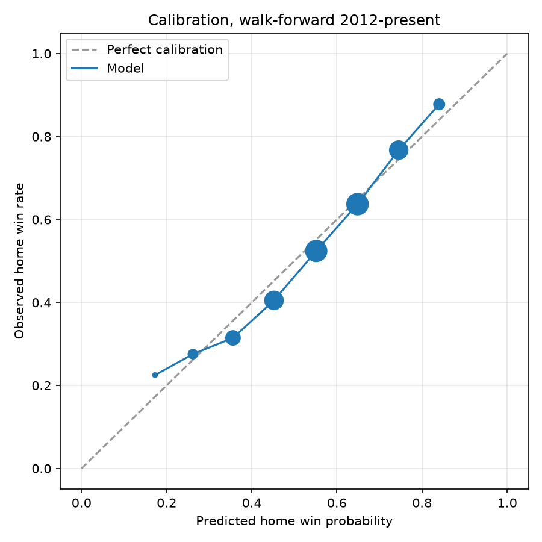

# NFL Game Predictor

Win probabilities for every NFL game, built from public play-by-play data, with
an explanation of what drove each pick. Predictions refresh automatically every
Tuesday and publish to a live page.

**[View this week's predictions →](https://trematt03.github.io/nfl-game-predictor/)**

```
2026 Week 1

  CLE at JAX   81.1% JAX    (Elo rating gap)
   NO at DET   75.0% DET    (Elo rating gap)
  ARI at LAC   72.6% LAC    (Elo rating gap)
   GB at MIN   50.2% MIN    (Quarterback play)
```

## Results

Evaluated **walk-forward**: to score any season, the model is trained only on
seasons before it. 3,816 games, 2012–2025.

| Model | Accuracy | Log loss | Brier | AUC |
|---|---|---|---|---|
| Always pick the home team | 55.6% | 0.687 | 0.247 | 0.500 |
| Elo only | 64.1% | 0.634 | 0.222 | 0.690 |
| Gradient boosting | 65.4% | 0.625 | 0.218 | 0.702 |
| **This model** | **65.2%** | **0.622** | **0.216** | **0.706** |
| Vegas closing moneyline | 66.5% | 0.609 | 0.211 | 0.720 |

Log loss is the number that matters — accuracy ignores whether a 51% call and a
90% call were equally confident. The model beats a strong Elo baseline and
closes about half the gap between Elo and the betting market, finishing within
a point of accuracy of the closing line. It does not beat the market, and I
would be suspicious of a hobby project that claimed to.



Calibration is the honest test of a probability model: games called at 70%
should be won about 70% of the time. The curve tracks the diagonal closely.

## What it does differently

Three findings came out of building this, and each changed the model.

**Team efficiency stats add almost nothing on top of Elo.** EPA per play,
success rate, explosive-play rate — I built all of them, and every combination
landed within noise of Elo alone (0.632 vs 0.632). Elo is computed from results,
and results already encode efficiency. This is a negative result, but it is the
kind worth reporting: most of the feature engineering was redundant.

**Injury reports are the only input that sees the future.** Every other feature
describes the team that *played*; the injury report describes the team about to
play. Worth −0.0022 log loss, the second largest gain in the project. As a
sanity check, in the 10% of games with the most lopsided injury gap the
healthier side won 64.1%.

Each absence is weighted by the player's own recent share of his unit's snaps,
so an every-down left tackle counts for far more than a rotational one — two
players at the same position are not the same loss. That beat hand-set position
weights (0.6216 against 0.6221), though only slightly; the stronger argument is
that it replaces my guesses with measurement.

The trap this feature invites is subtle. A player who sat has *no* snaps in the
week he was hurt, so weighting by current-week usage would silently turn the
feature into a readout of who did not play — an outcome, not a forecast. Snap
share is therefore taken strictly from earlier games, and
`test_snap_share_excludes_the_current_week` pins it.

**Quarterback play is what Elo misses.** Elo rates a *team*, and silently
assumes the roster that earned the rating is the roster that will play. That
assumption fails hardest at quarterback. Rating passers individually — EPA per
dropback, tracked per player so it follows a trade or a midseason takeover —
moved log loss from 0.633 to 0.625 and AUC from 0.690 to 0.700. It is the single
largest improvement in the project.

**Identifying the current starter is harder than it looks.** Taking each team's
most recent start seemed obviously correct and was badly broken: teams out of
contention rest their starters in Week 18, so the last passer to take a snap is
often a backup who will never start again. The first version projected Kansas
City's 2026 season with their third-string quarterback. Picking the most
frequent starter over a team's last 10 games fixes that, and
`tests/test_quarterback.py` pins the behaviour so it cannot come back.

Inference alone still cannot solve it, which is why `config/starters.json`
exists — see below.

## How it avoids fooling itself

Sports models are unusually easy to accidentally cheat with, so the guards are
explicit:

- **Every rolling feature is lagged.** Form is an exponentially weighted average
  shifted one game back, so a game never contributes to its own prediction.
  `test_form_never_sees_the_current_game` rewrites the final game to an absurd
  value and asserts the feature column does not move.
- **Evaluation respects time.** Walk-forward by season, never a random split.
- **Elo ratings are pre-game**, and take the off-season regression toward the
  mean before being used to forecast a later season. Skipping that produced Week
  1 probabilities above 86%, well past anything the market offers.
- **Thin samples are shrunk.** A quarterback with two starts is pulled toward
  replacement level rather than trusted at face value.

## Why the model is deliberately simple

Gradient boosting was tried and lost (0.629 vs 0.625). With ~5,000 training
games and features this correlated, the linear model both scores better and
gives an *exact* decomposition of every prediction: the log-odds is a sum of
per-feature terms, so "what drove this pick" is a real answer rather than an
approximation. `test_contributions_reconstruct_the_prediction` asserts those
terms add back up to the published probability.

Feature selection served that too. Including every efficiency metric made
coefficients unstable — passing efficiency came out *negative* — because the
metrics are collinear with each other and with Elo. Since those coefficients are
published as the explanation, unstable signs mean misleading explanations. The
trimmed set costs 0.0006 log loss and every sign is now interpretable:

| Feature | Coefficient |
|---|---|
| Elo rating gap | +0.363 |
| Quarterback play | +0.266 |
| Success rate | +0.151 |
| Explosive plays | +0.085 |
| Rest advantage | +0.070 |
| Neutral site | −0.048 |
| Divisional matchup | −0.045 |
| Turnovers | −0.022 |

Neutral site and divisional games both reduce the home edge, which is what the
football tells you should happen.

## Track record

Every prediction is written to `predictions_log.csv` when it is published and
never rewritten, then scored against the result once the game is played. The
live record appears at the top of the page.

The "never rewritten" part is the whole point. If a rerun could revise an
earlier call with a better-informed one, the record would quietly become
fiction — and would look like an improving model rather than a bug.
`test_a_rerun_cannot_revise_an_earlier_call` enforces it.

The log is committed back to the repo by the scheduled job, because a track
record regenerated each week by the current model is not a track record.

As a check that the scoring path agrees with the evaluation path, replaying
2025 as genuine out-of-sample predictions (trained through 2024 only) gives
181–103, 63.7%, 0.634 log loss — matching that season's walk-forward row.

## Draft capital, and a result that runs backwards

A passer with almost no professional record used to be shrunk toward a single
flat replacement level, which treats a first overall pick and an undrafted
backup identically. Using draft slot as the prior instead is worth −0.0013 log
loss overall, and −0.0051 on the 729 games where someone has under six career
starts — which is where it can possibly matter.

The priors themselves are the interesting part. Estimated on 2006–2011 only:

| Draft slot | Prior EPA/dropback |
|---|---|
| Undrafted | **+0.024** |
| Rest of round 1 | +0.010 |
| Top-10 pick | −0.005 |
| Round 4+ | −0.062 |
| Round 2 | −0.085 |
| Round 3 | −0.123 |

Undrafted quarterbacks have the *best* early record, and top-10 picks are
slightly below replacement. That is not a draft-capital effect, it is
survivorship: an undrafted passer only reaches a start if he has already proven
something, while a top-10 pick starts because of the capital sunk into him,
ready or not. The feature helps because it captures that selection structure —
not because being drafted early makes you good. Worth knowing before reading
anything into a high pick.

## What does not help

Things that sound like they should matter, tested and rejected. Each was judged
on whether it improved walk-forward log loss *on top of* the existing features,
not on whether it correlates with winning:

| Added | Log loss | Change |
|---|---|---|
| nothing (current model) | **0.6252** | — |
| First-season head coach | 0.6253 | +0.0001 |
| Head coach tenure | 0.6254 | +0.0002 |
| New head coach | 0.6254 | +0.0002 |
| All coaching features | 0.6257 | +0.0005 |
| Weather (wind, cold, dome) | 0.6258 | +0.0006 |
| Coaching + weather | 0.6264 | +0.0012 |

(Measured against the pre-injury model at 0.6252.)

Every one made the model worse. The coaching result is the interesting one,
because the raw effect looks convincing:

```
first-season coach   48.1% win rate,  mean Elo 1433
established coach    58.1% win rate,  mean Elo 1528
```

Teams under a new coach really do lose more. But they were already bad — that is
why the coach is new — and Elo has known it since last season. Once team
strength is controlled for, the coaching flag carries no information and only
adds variance. This is the same confound that makes "team X is 2-8 in their last
10" sound meaningful.

Weather behaves as expected: it hits both sides equally, so it moves total
points rather than who wins.

Reproduce with `python scripts/experiment_context.py`.

## Keeping starters current

Play-by-play can only show who started *last* season. An offseason trade or
signing is invisible until the player takes a snap for his new team, so in
September the inferred starter is stale for any team that changed quarterback —
which in 2026 was seven of them, including three straight swaps that inference
read exactly backwards (Cousins to Las Vegas, Tagovailoa to Atlanta, Smith to
the Jets).

No data source fixes this, so it is handled explicitly rather than pretended
away. `config/starters.json` records confirmed starters by season:

```json
"2026": {
  "ATL": "T.Tagovailoa",
  "LV":  "K.Cousins",
  "MIN": "K.Murray"
}
```

Only the *team assignment* is corrected. The rating still comes from that
passer's own career, whichever team he earned it on. A name that matches no
passer, or more than one, raises rather than quietly forecasting with the wrong
man.

```bash
python scripts/starters.py   # print all 32, flagging confirmed vs inferred
```

Worth running before trusting an early-season slate. These corrections are not
cosmetic — applying the 2026 set flipped Green Bay at Minnesota and moved
Miami at Las Vegas by seven points of win probability.

## Data

All public, no API keys, from [nflverse](https://github.com/nflverse):

- `play_by_play_{season}.parquet` — every play, 2009–2025
- `games.csv` — scores, rest days, closing betting lines, 1999–present
- `injuries_{season}.parquet` — weekly injury reports, 2009–present
- `draft_picks.parquet` — draft slot for every player since 1980
- `snap_counts_{season}.parquet` — per-player snap shares, 2012–present
- `players.parquet` — id bridge, because injuries key on gsis and snaps on pfr

Betting lines are used **only** as a benchmark to measure against, never as a
model input. Feeding the market's opinion in would mostly recover the market.

## Running it

```bash
pip install -r requirements.txt

python scripts/train.py        # fit on full history, save models/model.joblib
python scripts/backtest.py     # walk-forward evaluation → reports/
python scripts/predict_week.py # next week's slate → site/
python scripts/starters.py     # who each team is assumed to start
python scripts/experiment.py   # feature set and regularisation sweep
python scripts/experiment_context.py  # test coaching / weather features
python scripts/experiment_roster.py   # test injuries / draft priors
pytest tests/ -q
```

First run downloads ~400 MB of play-by-play and caches it in `data/`. After
that, `predict_week.py` pulls only the last six seasons, which is why the
scheduled job finishes in about a minute.

Six rather than three because the window is set by quarterbacks, not teams.
Team form forgets within a season and would be happy with three, but a backup
may have a handful of starts spread over several years, and a short window
keeps whichever of them happen to fall inside it. At three seasons one
quarterback with 7 career starts came out rated the second-best passer in the
league, because the window kept his good season and dropped his bad one. Six
seasons reproduces full-history ratings for all 32 starters. Training also
records career start counts to `models/qb_career.csv`, so a veteran returning
from injury is not shrunk like a rookie just because the window is short.

## Layout

```
src/nflpred/
  data.py         download and cache nflverse
  features.py     team-game aggregation, lagged form, Elo
  quarterback.py  per-passer ratings and starter identification
  dataset.py      game-level table, feature sets, de-vigged Vegas probabilities
  model.py        classifiers and walk-forward evaluation
  explain.py      exact per-game log-odds decomposition
  predict.py      forecasting unplayed games
  injuries.py     weekly injury burden by team
  tracking.py     prediction log and live scoring
  site.py         static page generator
config/           confirmed starting quarterbacks, maintained by hand
scripts/          train, backtest, experiment, predict_week, starters
tests/            56 tests, no network required
```

`.github/workflows/weekly.yml` reruns the forecast every Tuesday and deploys to
GitHub Pages.

## Limitations

- **Injury severity is invisible.** A player listed Out is weighted the same
  whether he misses one week or the season, and teams under-report by design.
- **Snap counts only exist from 2012**, so 2009–2011 injuries fall back to
  average usage for the position.
- **The starting quarterback is assumed, not known.** It is whoever
  `config/starters.json` names, falling back to whoever started most of the last
  10 games. A midweek injury or a late announcement will not be reflected until
  that file is updated.
- **No weather, travel distance, or short-week specifics** beyond rest days.
- **Week 1 is the weakest week**, leaning on regressed prior-season ratings with
  no current-season evidence at all.

Predictions are published for interest and not as betting advice.

## Licence

MIT
